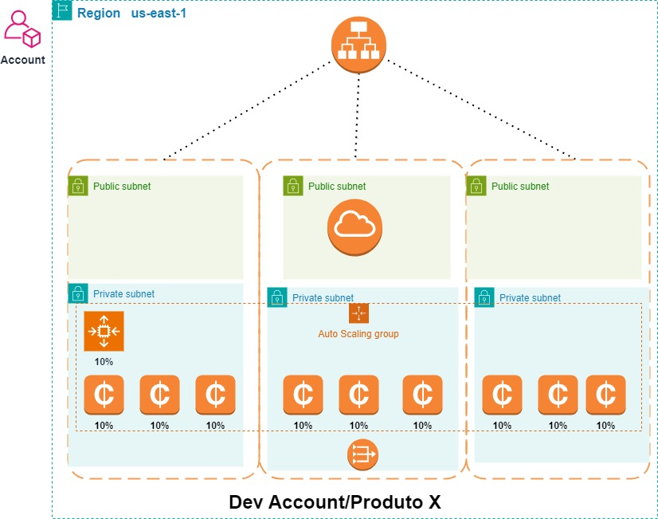

# Orquestração de Escalabilidade na Nuvem: Load Balancer, Auto Scaling e Spot Instances na AWS

Esse título enfatiza a utilização de tecnologias-chave, como Load Balancer, Auto Scaling e Spot Instances, enquanto sugere um foco na eficiência e escalabilidade na nuvem AWS.

## Arquitetura do projeto

<!-- BEGIN_TF_DOCS -->
## Requirements

| Name | Version |
|------|---------|
|  [aws](#requirement\_aws) | 5.51.1 |

## Providers

| Name | Version |
|------|---------|
|  [aws](#provider\_aws) | 5.51.1 |

## Modules

| Name | Source | Version |
|------|--------|---------|
|  [vpc](#module\_vpc) | terraform-aws-modules/vpc/aws | 5.8.1 |

## Resources

| Name | Type |
|------|------|
| [aws_autoscaling_attachment.app](https://registry.terraform.io/providers/hashicorp/aws/5.51.1/docs/resources/autoscaling_attachment) | resource |
| [aws_autoscaling_group.bar](https://registry.terraform.io/providers/hashicorp/aws/5.51.1/docs/resources/autoscaling_group) | resource |
| [aws_eip.nat](https://registry.terraform.io/providers/hashicorp/aws/5.51.1/docs/resources/eip) | resource |
| [aws_launch_template.teste](https://registry.terraform.io/providers/hashicorp/aws/5.51.1/docs/resources/launch_template) | resource |
| [aws_lb.app](https://registry.terraform.io/providers/hashicorp/aws/5.51.1/docs/resources/lb) | resource |
| [aws_lb_listener.app](https://registry.terraform.io/providers/hashicorp/aws/5.51.1/docs/resources/lb_listener) | resource |
| [aws_lb_target_group.app](https://registry.terraform.io/providers/hashicorp/aws/5.51.1/docs/resources/lb_target_group) | resource |
| [aws_security_group.app_lb](https://registry.terraform.io/providers/hashicorp/aws/5.51.1/docs/resources/security_group) | resource |
| [aws_security_group.sg_ec2](https://registry.terraform.io/providers/hashicorp/aws/5.51.1/docs/resources/security_group) | resource |
| [aws_availability_zones.available](https://registry.terraform.io/providers/hashicorp/aws/5.51.1/docs/data-sources/availability_zones) | data source |

## Inputs

No inputs.

## Outputs

No outputs.
<!-- END_TF_DOCS -->

